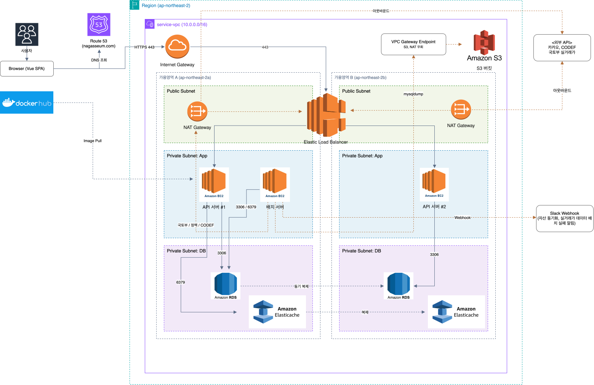

# nagasseum-cheongnyeon (backend)

MZ세대의 독립 준비를 위한 자산 관리 플랫폼 **나갔음 청년**의 백엔드 레포지토리입니다.

> 개발 환경 최초 세팅은 **[Onboarding.md](./Onboarding.md)** 를 순서대로 따라오세요.

---

## 서비스 소개

청년이 전월세 독립 목표를 세우고, 금융 자산을 연동해 달성률을 추적하며, 다른 사용자와 비교하는 플랫폼입니다.

| 핵심 기능 | 설명                                             |
| --- |------------------------------------------------|
| 자산 연동 | CODEF API로 은행, 증권, 카드, 대출 계좌를 실시간 동기화          |
| 독립 목표 | 지역, 주택유형, 전월세 조건 설정 → 달성률 및 잔여 기간 계산           |
| 몬테카를로 시뮬레이션 | GBM 기반 1만 경로 시뮬레이션으로 목표 시점 주택 가격 분포 및 달성 확률 제공 |
| 시세 변동 알림 | 실거래 중위가 변화 감지 → 목표 재조정 배너 노출                   |
| 또래 비교 | 동일 코호트(나이, 소득 분위) 자산과 목표 달성률 비교                |
| 카카오 로그인 | OAuth2 + JWT (Access / Refresh Token)          |

---

## 기술 스택

| 구분 | 기술                                      |
| --- |-----------------------------------------|
| Language | Java 17                                 |
| Framework | Spring Framework 5.3                    |
| ORM | MyBatis                                 |
| Build | Maven (WAR Packaging)                   |
| WAS | Tomcat 9.0.118                          |
| DB | MySQL 8.0 (AWS RDS)                     |
| Cache / Lock | Redis 7 (AWS ElastiCache)               |
| Auth | Kakao OAuth2 + JWT                      |
| External API | CODEF, 국토부, Kakao, Slack Webhook |
| CI/CD | GitHub Actions → Docker Hub → EC2       |

### 기술 선택 배경

1. Spring Legacy (Boot 아님): 부트캠프 최종 프로젝트 제약 조건입니다. Spring Boot, JPA 사용 불가입니다.


2. MyBatis: 복잡한 집계 쿼리(다른 사용자 비교, 자산 요약)가 많고, SQL을 직접 제어해야 하는 상황이 잦아 JPA보다 적합하다고 판단했습니다. 최종 프로젝트 제약 조건이기도 합니다.


3. 몬테카를로 시뮬레이션: 목표 시점의 주택 가격을 단순 CAGR로 예측하면 불확실성을 표현할 수 없습니다. GBM(기하 브라운 운동) 기반 시뮬레이션으로 P5 / P50 / P95 분포와 달성 확률을 함께 제공합니다. 가격 모델(μ, σ)은 국토부 실거래 시계열에 OLS 회귀를 적용해 추정합니다.

---

## 아키텍처

### 도메인 의존 방향

```
goal ──→ asset
goal ──→ property
compare ──→ asset
compare ──→ goal
```

`asset`, `member`는 다른 도메인을 모릅니다. 역방향 참조는 철저히 배제했습니다.

### 레이어 구조

```
Controller / Scheduler
        ↓
     Service  (@Transactional)
        ↓
      Mapper   (@Mapper)
        ↓
        DB
```

- Controller는 Mapper를 직접 호출하지 않습니다.
- 다른 도메인에 접근할 때는 반드시 그 도메인의 서비스 계층을 통합니다.
- 외부 API 호출은 `external/` 패키지에서만 합니다.

### 배치 흐름 (매월 1일)

```
04:00  RentTransactionSyncScheduler  →  국토부 API 호출  →  rent_transaction 적재
04:00  AssetSyncScheduler  →  CODEF API 호출  →  자산 계좌 동기화 (매일)
05:00  GoalSnapshotScheduler  →  자산/목표 기반  →  goal_snapshot 기록 (다른 사용자와의 비교용)
06:00  GoalMarketTrendScheduler  →  실거래 중위가  →  Redis 캐시 갱신
```

---

## 패키지 구조

```
com.team.independence
├── auth/            카카오 OAuth2, JWT 인증
├── member/          회원 정보 관리
├── asset/           자산 연동 / 동기화 / 진단
├── goal/            독립 목표 설정 / 추적 / 시뮬레이션
├── compare/         비교
├── property/        전월세 실거래 조회 / 가격 모델
├── policy/          공공 정책 추천 (추후 개발 예정)
├── scheduler/       배치 스케줄러 (batch 프로필 전용)
├── external/        외부 API 클라이언트 (CODEF, Slack)
├── common/          공통 인프라 (응답 포맷, 예외, 보안)
└── config/          설정
```

---

## API 엔드포인트

<details>
<summary>인증 (/api/v1)</summary>

| 메서드 | 경로 | 설명 |
| --- | --- | --- |
| GET | `/oauth/kakao/callback` | 카카오 OAuth 콜백 |
| POST | `/oauth/kakao/signup` | 추가 정보 입력 후 회원 가입 |
| POST | `/auth/refresh` | Access Token 재발급 |
| POST | `/auth/logout` | 로그아웃 (Refresh Token 폐기) |

</details>

<details>
<summary>회원 (/api/v1/members)</summary>

| 메서드 | 경로 | 설명 |
| --- | --- | --- |
| GET | `/me` | 내 정보 조회 |
| PATCH | `/me` | 내 정보 수정 |
| PATCH | `/me/agreements` | 전체 약관 동의 |
| PATCH | `/me/agreements/{type}` | 개별 약관 동의 |
| GET | `/health` | 헬스체크 |

</details>

<details>
<summary>자산 (/api/v1/assets)</summary>

| 메서드 | 경로 | 설명               |
| --- | --- |------------------|
| GET | `/organizations` | 연동 가능 기관 목록      |
| POST | `/link` | 기관 계좌 연동 (CODEF) |
| GET | `/connections` | 연동된 기관 목록        |
| DELETE | `/connections/organizations/{code}` | 기관 연동 해제         |
| POST | `/sync` | 자산 동기화 시작 (비동기)  |
| GET | `/sync/status/{jobId}` | 동기화 상태 조회        |
| GET | `/summary` | 자산 요약            |
| GET | `/accounts` | 은행, 증권, 대출 계좌 목록 |
| GET | `/cards` | 카드 목록            |
| GET | `/manual` | 수동 자산 목록         |
| POST | `/manual` | 수동 자산 등록         |
| PUT | `/manual/{id}` | 수동 자산 수정         |
| DELETE | `/manual/{id}` | 수동 자산 삭제         |

</details>

<details>
<summary>목표 (/api/v1/goals)</summary>

| 메서드 | 경로 | 설명                                     |
| --- | --- |----------------------------------------|
| POST | `/diagnosis` | 목표 진단 (자산 기반 추천)                       |
| POST | `/recommendations` | 추천 목표 생성                               |
| POST | `` | 목표 생성                                  |
| GET | `/{goalId}` | 목표 조회                                  |
| PUT | `/{goalId}` | 목표 수정                                  |
| DELETE | `/{goalId}` | 목표 삭제 (ARCHIVED 처리)                    |
| GET | `/{goalId}/detail` | 목표 상세, 달성률                             |
| GET | `/{goalId}/simulations/monthly-saving` | 월 저축액 시뮬레이션                            |
| GET | `/{goalId}/simulation` | GBM 몬테카를로 시뮬레이션 (P5 / P50 / P95, 달성확률) |
| GET | `/market-trend` | 시세 변동 배너                               |
| GET | `/summary` | 목표 요약                                  |

</details>

<details>
<summary>비교 (/api/v1/comparison)</summary>

| 메서드 | 경로 | 설명 |
| --- | --- | --- |
| GET | `` | 종합 비교 |
| GET | `/assets` | 자산 비교 |
| GET | `/goals` | 목표 비교 |

</details>

<details>
<summary>매물 (/api/v1/properties)</summary>

| 메서드 | 경로 | 설명 |
| --- | --- | --- |
| GET | `/median` | 지역, 주택유형별 전월세 중위가 |

</details>

<details>
<summary>관리 (/api/v1/admin/batch)</summary>

> 인증 없이 호출 가능. 인증 완성 후 관리자 권한 체크 예정

| 메서드 | 경로 | 설명 |
| --- | --- | --- |
| POST | `/all` | 전체 배치 순서대로 실행 (초기 데이터 세팅 시 사용) |
| POST | `/rent-sync` | 전월세 실거래 동기화만 실행 |
| POST | `/snapshots` | 이번 달 목표 스냅샷 생성만 실행 |
| POST | `/market-trends` | 시세 변화 캐시 갱신만 실행 |

</details>

---

## 응답 포맷

```json
// 성공
{ "success": true, "data": { ... }, "error": null }

// 실패
{ "success": false, "data": null, "error": { "code": "MEMBER_001", "message": "회원을 찾을 수 없습니다." } }
```

---

## 인프라 구성 (AWS)




---

## 초기 데이터 세팅

인프라를 새로 구축했거나 DB가 비어 있을 때 아래 순서대로 실행합니다.

### 1. DDL 실행 (EC2에서)

```bash
# EC2(SSM)에서 SQL 파일 다운로드
curl -o /tmp/full_schema.sql https://raw.githubusercontent.com/kb-final/nagasseum-cheongnyeon_backend/develop/sql/full_schema.sql
curl -o /tmp/institution_master.sql https://raw.githubusercontent.com/kb-final/nagasseum-cheongnyeon_backend/develop/sql/institution_master.sql
curl -o /tmp/region_initialize.sql https://raw.githubusercontent.com/kb-final/nagasseum-cheongnyeon_backend/develop/sql/region_initialize.sql

# RDS에 순서대로 실행
mysql -h {RDS엔드포인트} -u {유저명} -p{비밀번호} independence < /tmp/full_schema.sql
mysql -h {RDS엔드포인트} -u {유저명} -p{비밀번호} independence < /tmp/institution_master.sql
mysql -h {RDS엔드포인트} -u {유저명} -p{비밀번호} independence < /tmp/region_initialize.sql
```

### 2. 실거래 데이터 수집 (배치 수동 트리거)

월 1일 스케줄 실행 전이라면 API로 수동 트리거합니다.

```bash
curl -X POST https://{API서버주소}/api/v1/admin/batch/all
```

실거래 동기화(6개월 × 전체 지역 × 4종)는 수십 분이 소요됩니다.
504 응답이 와도 서버에서 배치가 계속 실행되므로 서버 로그로 완료 여부를 확인하세요.

```bash
sudo docker logs -f $(sudo docker ps -q) 2>&1 | grep "배치"
```

---

## 배포

`develop` 브랜치에 push되면 GitHub Actions가 자동으로 빌드하고 Docker Hub에 이미지를 푸시합니다.

```
develop push
  → ./mvnw clean package -DskipTests (JDK 17)
  → docker build (tomcat:9-jdk17-temurin 기반)
  → Docker Hub push (:latest, :{SHA})
```

EC2에서는 새 이미지를 pull 받아 컨테이너를 재시작합니다.

### 로컬에서 Docker 이미지로 실행

```bash
JAVA_HOME=$(/usr/libexec/java_home -v 17) ./mvnw clean package -DskipTests
docker build -t nagasseum-backend .

docker run -d --name nagasseum-backend --env-file .env -p 8080:8080 nagasseum-backend
```

---

## 외부 연동

| 서비스 | 용도                                 |
| --- |------------------------------------|
| CODEF | 은행, 증권, 카드 계좌 조회 및 Connected ID 관리 |
| MOLIT (국토부) | 전월세 실거래 수집 (아파트 / 연립 / 오피스텔 / 단독)  |
| Kakao | OAuth2 로그인 및 사용자 정보 조회             |
| Slack Webhook | 배치 실패 알림                           |

`local` 프로필에서 CODEF는 Mock 클라이언트(`CodefMockClient`)로 대체됩니다.
